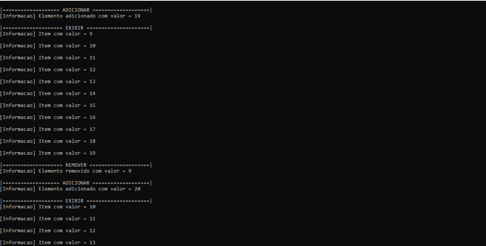
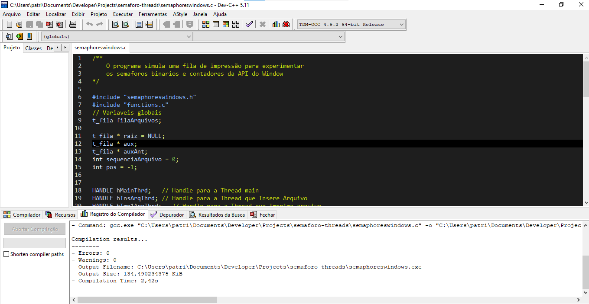

<h1 align="center">SEMAFORO COM THREADS</h1><!--Nome curto e objetivo-->
<h5 align="center">Status: Concluido </h5><!--Concluido, Em andamento ou Finalizado-->

<h2>Sumário</h2>
<!--Sumário que leva as sessões do readme-->
<ul>
    <li><a href="#sobre">Sobre</a></li>
    <li><a href="#requisitosmacro">Requisitos macro</a></li>
    <li><a href="#demo">Demonstração da aplicação</a></li>
    <li><a href="#prereq">Pré-requisitos e como rodar a aplicação</a></li>
    <li><a href="#tec">Tecnologias utilizadas</a></li>
    <li><a href="#autor">Responsáveis</a></li>
</ul>

<h2 id="sobre">💻 Sobre</h2>
<!--Descrição do contexto e produto do projeto - Consulte o documento F001-NDSI-Levantamento de Macro Requisitos-->

Este é um programa na linguagem C, em que threads manipulem uma lista compartilhada contendo números inteiros (estrutura global). Quatro threads deverão acessar a lista apenas para leitura, exibindo na tela o seu conteúdo, enquanto uma thread fará aleatóriamente inclusões e exclusões de números na lista.

A garantia da consistência da lista (exclusão mútua) deverá ser feita com o uso de semáforos.

<h2 id="requisitosmacro">📝 Requisitos macro</h2>
<!--Lista de todos as funcionalidades do sistema (nível macro)-->
<ul>
    <li>Inserir item na lista</li>
    <li>Remover item na lista</li>
    <li>Exibir todos os itens da lista</li>
</ul>

<h2 id="demo">🎥 Demonstração da aplicação</h2>
<!--Conjunto de prints da aplicação-->
<h1 align="center">
    
    
</h1>

<h2 id="prereq">📀 Pré-requisitos e como rodar a aplicação</h2>
<!--Descrição do pré requisito de instalação na maquina em forma de passo a passo-->
<ol>
    <li>Baixe o projeto e utilize a IDE Dev C++ incluido no projeto</li>
    <li>Acesse o arquivo semaphoreswindows.c e compile e execute</li>
    <li>O sistema vai abrir um terminal para execução</li>
</ol>

<h2 id="tec">🔨Tecnologias utilizadas</h2>
<!--Descrição das tecnologias utilizadas (linguagem, biblioteca, framework etc)-->

As seguintes ferramentas foram utilizadas na construção do projeto:

<ul>
    <li>C</li>
    <li>Threads</li>
    <li>Bibliotecas em C</li>
</ul>

<h2 id="autor">👦 Responsáveis</h2>
<!--Listagem dos responsáveis pelo projeto-->
<ul>
   <li>Patrick Guilherme</li>
<ul>
